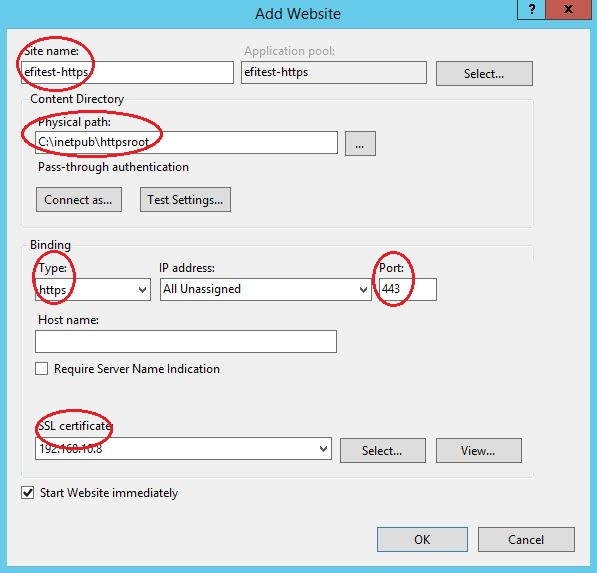

## Configure Server and Build Client {#configure-server-and-build-client}

A UEFI HTTPS boot server has three main roles:

1.  DHCP server
2.  DNS server
3.  HTTPS server

Depending on server requirements, two test-bed solutions are presented for reference: one simple approach for IPv4, and an advanced solution using IPv6\. Users can select the proper scenario based on individual requirements. Self-generated certificates from Table 2 (‘rootcert.pem’ and ‘server.pfx’) are used for HTTPS one-way authentication.

### Solution for IPv4 {#solution-for-ipv4}

The solution documented in this section uses a single server for the DHCP, DNS and HTTPS functions. This is considered the simplest server configuration for UEFI HTTPS Boot.

#### Network Topology for IPv4 {#network-topology-for-ipv4}

This example is based on Microsoft Windows Server 2012 R2\. Internet Information Services (IIS) are used to configure HTTPS server. The server and NT32 simulator use the same IPv4 subnet (192.168.10.0) as shown in Figure 2.

Figure : HTTPS Boot, IPv4 Configuration

#### Configure DHCPv4 Server {#configure-dhcpv4-server}

The steps to configure a DHCPv4 server are as follows:

1.  Add a DHCP service in Windows Server. Please refer to the installation steps available here: http://thetechnosolution.com/installing-and-configuring-dhcp-on-windows-server-2012-r2/.
2.  Right click on ‘IPv4 – New Scope’ to create a new scope option for IPv4 including the scope name, address range, and IP address lease duration. See Figure 3 for details.

Figure : DHCPv4 Server Scope

1.  Right click ‘Server Options – Configure Options…’ to configure IPv4 options including option 6, 60 and 67\. These options must be configured for proper functionality. After configuration, the options should appear as shown in Figure 4\. If the corresponding option code doesn’t appear in ‘Server Options – Configure Options…’ then right click ‘IPv4 – Set Predefined Options’, and click the ‘Add’ button to add the predefined option.
    1.  Option 6 indicates the DNS server address.
    2.  Option 60 defines the vendor Class ID. The value should be set to ‘HTTPClient’.
    3.  Option 67 contains the corresponding boot file URI.

Figure 4: DHCPv4 Server Options

1.  Right click the DHCP server name and select the ‘All Tasks – Restart’ option to restart the DHCPv4 service.

#### Configure DNSv4 Server {#configure-dnsv4-server}

The steps to configure the DNSv4 server are as follows:

1.  Add the DNS service in Windows Server Manager – ‘Add roles and features’.
2.  Add a new forward lookup zone named ‘cloudboot.com’.
3.  Add a new Host “www” for IPv4 (192.168.10.8). See Figure 5 for reference.

Figure : Configure New Host for IPv4

1.  Right click the DHCP server name and select the ‘All Tasks – Restart’ option to restart the DHCPv4 service.

#### Configure HTTPS Server for IPv4 {#configure-https-server-for-ipv4}

The steps to configure the HTTPS server are as follows:

1.  Enable the Internet Information Services (IIS) feature in Windows Server manager, based on installation steps available here: [http://www.iis.net/learn/install/installing-iis-85/installing-iis-85-on-windows-server-2012-r2](http://www.iis.net/learn/install/installing-iis-85/installing-iis-85-on-windows-server-2012-r2).
2.  Open the Internet Information Services (IIS) Manager, and add a new MIME type for the resources required by the HTTPS server. For the approved media type by IANA (e.g. *.efi/*.img/*.iso), please refer to the [http://www.iana.org/assignments/media-types](http://www.iana.org/assignments/media-types). In this example, the client will boot to a UEFI Shell image provided by the server. This requires addition of the .efi file type. Figure 6 and Figure 7 show the detailed steps.

Figure : Add MIME Type

Figure : Add a New MIME Type to IIS

1.  Enroll the Server key pair (server.pfx) in ‘Server Certificates’. Refer to Figure 8 and Figure 9 for details. Here, we assume the server.pfx has been generated. For detailed steps, please refer to section 2.2\.

Figure : Add Server Certificates

Figure : Enroll a Certificate for the HTTPS Server

1.  Create a ‘httpsroot’ folder in ‘C:\inetpub’ as a default root path (C:\inetpub\httpsroot).
2.  Right-click on ‘Sites – Add Website’ to create a new website for the HTTPS server. The areas highlighted in Figure 10 are required fields. The ‘Physical path’ is the default root path for the website. The ‘SSL certificate’ is the server key’s (server.pfx) common name (192.168.10.8), which was enrolled in Step 3\. The binding type is ‘https’ and the binding port value is ‘443’.

Figure : Create a New Website for the HTTPS Server

1.  Create an ‘EFI’ folder in default root path, which was configured in Step 5\. Copy the UEFI Shell binary that matches your firmware configuration into this folder (C:\inetpub\httpsroot\EFI). The UEFI Shell binary is in the ShellBinPkg package on EDK II ([https://github.com/tianocore/edk2/tree/master/ShellBinPkg](https://github.com/tianocore/edk2/tree/master/ShellBinPkg)).The file should be renamed Shell.efi to match the configuration in DHCP option 67\. This sets the UEFI Shell boot path as [https://www.cloudboot.com:443/EFI/Shell.efi](https://www.cloudboot.com:443/EFI/Shell.efi).

Figure : The UEFI Shell file, as viewed in IIS

The NT32 Simulator uses the IA32 UEFI Shell binary, while most production systems require the x64 UEFI Shell to match the UEFI firmware configuration. This depends on your platform firmware configuration.

#### Enable NT32 Simulator for IPv4 {#enable-nt32-simulator-for-ipv4}

To enable the UEFI HTTPSv4 Boot feature, the EDKII network stack (IPv4) must be built in your system firmware, which is located at [MdeModulePkg/Universal/Network](https://github.com/tianocore/edk2/tree/master/MdeModulePkg/Universal/Network). Here, the verified version is: [**d52f9163debb523e06d49ed8a4627a0317bab92c**](https://github.com/tianocore/edk2/commit/d52f9163debb523e06d49ed8a4627a0317bab92c).

**Modules in DSC file**

The following libraries and drivers are required by HTTPSv4 boot:

Add the following libraries to the LibraryClasses section:

DpcLib|MdeModulePkg/Library/DxeDpcLib/DxeDpcLib.inf

NetLib|MdeModulePkg/Library/DxeNetLib/DxeNetLib.inf

IpIoLib|MdeModulePkg/Library/DxeIpIoLib/DxeIpIoLib.inf

UdpIoLib|MdeModulePkg/Library/DxeUdpIoLib/DxeUdpIoLib.inf

TcpIoLib|MdeModulePkg/Library/DxeTcpIoLib/DxeTcpIoLib.inf

HttpLib|MdeModulePkg/Library/DxeHttpLib/DxeHttpLib.inf

OpensslLib|CryptoPkg/Library/OpensslLib/OpensslLib.inf

BaseCryptLib|CryptoPkg/Library/BaseCryptLib/BaseCryptLib.inf

TlsLib|CryptoPkg/Library/TlsLib/TlsLib.inf

Add the following drivers to the Components section:

MdeModulePkg/Universal/Network/DpcDxe/DpcDxe.inf

MdeModulePkg/Universal/Network/SnpDxe/SnpDxe.inf

MdeModulePkg/Universal/Network/MnpDxe/MnpDxe.inf

MdeModulePkg/Universal/Network/ArpDxe/ArpDxe.inf

MdeModulePkg/Universal/Network/Ip4Dxe/Ip4Dxe.inf

MdeModulePkg/Universal/Network/Tcp4Dxe/Tcp4Dxe.inf

MdeModulePkg/Universal/Network/Udp4Dxe/Udp4Dxe.inf

MdeModulePkg/Universal/Network/Dhcp4Dxe/Dhcp4Dxe.inf

NetworkPkg/HttpDxe/HttpDxe.inf

NetworkPkg/HttpBootDxe/HttpBootDxe.inf

NetworkPkg/HttpUtilitiesDxe/HttpUtilitiesDxe.inf

NetworkPkg/DnsDxe/DnsDxe.inf

NetworkPkg/TlsDxe/TlsDxe.inf

NetworkPkg/TlsAuthConfigDxe/TlsAuthConfigDxe.inf

The network controller’s UNDI driver also needs to be in the list of platform files.

**Modules in FDF file**

The following drivers should be added to the FV section for HTTPSv4 boot:

INF MdeModulePkg/Universal/Network/DpcDxe/DpcDxe.inf

INF MdeModulePkg/Universal/Network/SnpDxe/SnpDxe.inf

INF MdeModulePkg/Universal/Network/MnpDxe/MnpDxe.inf

INF MdeModulePkg/Universal/Network/ArpDxe/ArpDxe.inf

INF MdeModulePkg/Universal/Network/Ip4Dxe/Ip4Dxe.inf

INF MdeModulePkg/Universal/Network/Tcp4Dxe/Tcp4Dxe.inf

INF MdeModulePkg/Universal/Network/Udp4Dxe/Udp4Dxe.inf

INF MdeModulePkg/Universal/Network/Dhcp4Dxe/Dhcp4Dxe.inf

INF NetworkPkg/HttpDxe/HttpDxe.inf

INF NetworkPkg/HttpBootDxe/HttpBootDxe.inf

INF NetworkPkg/HttpUtilitiesDxe/HttpUtilitiesDxe.inf

INF NetworkPkg/DnsDxe/DnsDxe.inf

INF NetworkPkg/TlsDxe/TlsDxe.inf

INF NetworkPkg/TlsAuthConfigDxe/TlsAuthConfigDxe.inf

**Build the NT32 Simulator**

The following command is used to build NT32 using Microsoft Visual Studio 2013:

build -a IA32 –t VS2013x86 -p Nt32pkg\Nt32Pkg.dsc

### Solution for IPv6 {#solution-for-ipv6}

For IPv6, the DHCP, DNS and HTTPS server are deployed on different systems. This solution provides a more flexible configuration for the DHCP server, DNS server and HTTPS Server.

#### Network Topology for IPv6 {#network-topology-for-ipv6}

In this example, the DHCP server is deployed on Ubuntu 15.10\. The DNS server is deployed on Windows Server 2012 R2, and the HTTPS Server is deployed on another instance of Windows Server 2012 R2\. IIS is used to configure HTTPS server. The servers and NT32 simulator are located on the same IPv6 subnet (2000:bbbb::/64) as shown in Figure 12.

Figure : HTTPS boot, IPv6 Configuration

#### Configure the DHCPv6 Server {#configure-the-dhcpv6-server}

The steps to configure DHCPv6 on an Ubuntu 15.10 server are shown as follows:

1.  Install the DHCP server: sudo apt-get install isc-dhcp-server
2.  Edit /etc/dhcp/dhcpd6.conf as shown below

If there is no dhcpd6.conf file in /etc/dhcp/, create it first.

| default-lease-time 600; |
| --- |

1.  Configure the server to listen for DHCP requests on the correct network interface. This example assumes eth0 is the primary interface. Edit the /etc/default/isc-dhcp-server file to configure INTERFACE = “eth0”;
2.  Restart the DHCPv6 service: sudo service isc-dhcp-server6 restart

#### Configure DNSv6 Server {#configure-dnsv6-server}

The steps to configure DNSv6 for Microsoft Windows Server 2002 R2 are as follows:

1.  Add the DNS service in Windows Server Manager – ‘Add roles and features’.
2.  Add a new forward lookup zone ‘cloudboot.com’ (see Figure 13).

Figure : Configure Forward Lookup Zone for IPv6

1.  Add a new Host “www” for IPv6 (2000:bbbb::8) as shown in Figure 14.

Figure : Configure New Host for IPv6

1.  Right click the DNS server name and select the ‘All Tasks – Restart’ option to restart the DNSv6 service.

#### Configure HTTPS Server for IPv6 {#configure-https-server-for-ipv6}

Please refer to Section 3.1.1.4, as this step is not dependent on IPv4 or IPv6.

#### Enable NT32 Simulator for IPv6 {#enable-nt32-simulator-for-ipv6}

To enable the UEFI Boot feature for HTTPSv6, the EDKII network stack (IPv6) must be built in your system firmware, which is located at [NetworkPkg](https://github.com/tianocore/edk2/tree/master/NetworkPkg). Here, the verified version is: [7cf59c854f35c9680965fe83e9cfd863079ddd73](https://github.com/tianocore/edk2/commit/7cf59c854f35c9680965fe83e9cfd863079ddd73).

**Modules in DSC file**

The following libraries and drivers are required by HTTPSv6 boot:

Add the following libraries to the LibraryClasses section:

DpcLib|MdeModulePkg/Library/DxeDpcLib/DxeDpcLib.inf

NetLib|MdeModulePkg/Library/DxeNetLib/DxeNetLib.inf

IpIoLib|MdeModulePkg/Library/DxeIpIoLib/DxeIpIoLib.inf

UdpIoLib|MdeModulePkg/Library/DxeUdpIoLib/DxeUdpIoLib.inf

TcpIoLib|MdeModulePkg/Library/DxeTcpIoLib/DxeTcpIoLib.inf

HttpLib|MdeModulePkg/Library/DxeHttpLib/DxeHttpLib.inf

OpensslLib|CryptoPkg/Library/OpensslLib/OpensslLib.inf

BaseCryptLib|CryptoPkg/Library/BaseCryptLib/BaseCryptLib.inf

TlsLib|CryptoPkg/Library/TlsLib/TlsLib.inf

Add the following drivers to the Components section:

MdeModulePkg/Universal/Network/DpcDxe/DpcDxe.inf

MdeModulePkg/Universal/Network/SnpDxe/SnpDxe.inf

MdeModulePkg/Universal/Network/MnpDxe/MnpDxe.inf

NetworkPkg/Ip6Dxe/Ip6Dxe.inf

NetworkPkg/TcpDxe/TcpDxe.inf

NetworkPkg/Udp6Dxe/Udp6Dxe.inf

NetworkPkg/Dhcp6Dxe/Dhcp6Dxe.inf

NetworkPkg/HttpDxe/HttpDxe.inf

NetworkPkg/HttpBootDxe/HttpBootDxe.inf

NetworkPkg/HttpUtilitiesDxe/HttpUtilitiesDxe.inf

NetworkPkg/DnsDxe/DnsDxe.inf

NetworkPkg/TlsDxe/TlsDxe.inf

NetworkPkg/TlsAuthConfigDxe/TlsAuthConfigDxe.inf

The network controller’s UNDI driver also needs to be in the list of platform files

**Modules in FDF file**

The following drivers are required in the FV section for HTTPSv6 boot:

INF MdeModulePkg/Universal/Network/DpcDxe/DpcDxe.inf

INF MdeModulePkg/Universal/Network/SnpDxe/SnpDxe.inf

INF MdeModulePkg/Universal/Network/MnpDxe/MnpDxe.inf

INF NetworkPkg/Ip6Dxe/Ip6Dxe.inf

INF NetworkPkg/TcpDxe/TcpDxe.inf

INF NetworkPkg/Udp6Dxe/Udp6Dxe.inf

INF NetworkPkg/Dhcp6Dxe/Dhcp6Dxe.inf

INF NetworkPkg/HttpDxe/HttpDxe.inf

INF NetworkPkg/HttpBootDxe/HttpBootDxe.inf

INF NetworkPkg/HttpUtilitiesDxe/HttpUtilitiesDxe.inf

INF NetworkPkg/DnsDxe/DnsDxe.inf

INF NetworkPkg/TlsDxe/TlsDxe.inf

INF NetworkPkg/TlsAuthConfigDxe/TlsAuthConfigDxe.inf

**Build the NT32 Simulator**

The following command is used to build NT32 using Microsoft Visual Studio 2013:

build -a IA32 –t VS2013x86 -p Nt32pkg\Nt32Pkg.dsc